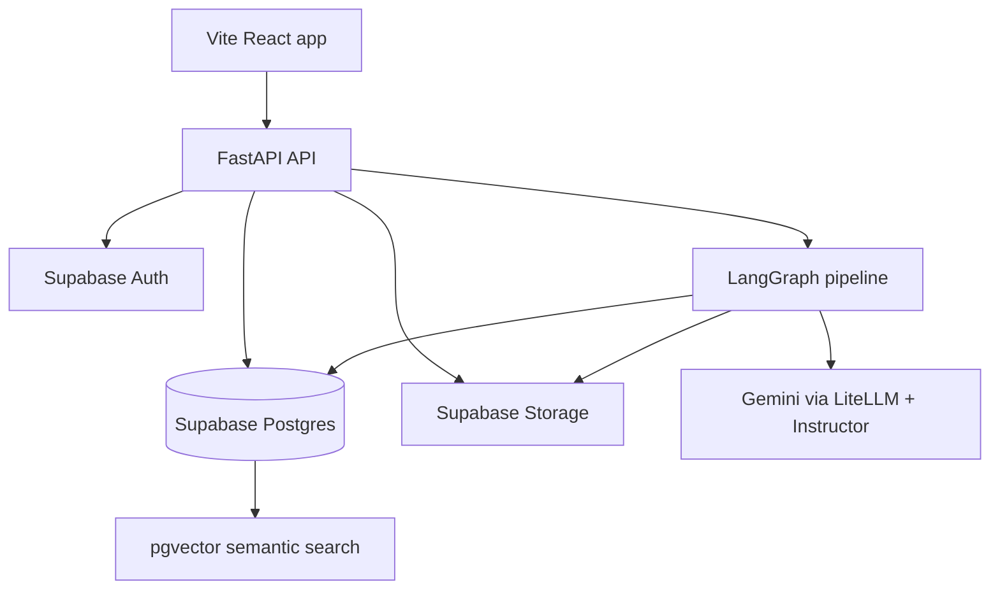
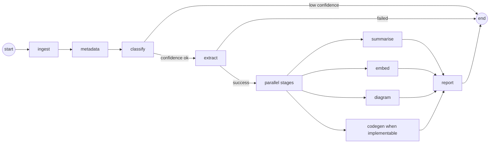

# Architecture

Research Pilot has three main surfaces:

- A Vite React frontend for ingestion, library browsing, pipeline progress, and paper viewing.
- A FastAPI backend for auth-aware paper APIs, pipeline run management, search, and exports.
- A LangGraph pipeline that turns papers into typed outputs.

## System Overview



## Pipeline Topology



`pipeline/src/graph/pipeline.py` owns the graph topology. Nodes are isolated in `pipeline/src/graph/nodes/`, and routing logic lives in `pipeline/src/graph/edges.py`.

## Why LangGraph

Research Pilot is not a single prompt. It is a multi-stage workflow with routing, resumability, stage status, and independent outputs. LangGraph gives the project a clear graph model for:

- Stage boundaries and retry behavior.
- Conditional routing after classification and extraction.
- Parallel downstream work after structured extraction.
- A single compiled graph that services can invoke and track.

## Why Gemini Native PDF Understanding

The pipeline needs diagrams, tables, equations, and figure-level context. A text-only parser loses too much of that information before extraction starts. Gemini native PDF understanding lets the extraction stage reason over the paper as a full document and then Instructor validates the model output into typed schemas.

## Domain Plugins

Domain plugins let the system adapt schemas and prompts without hardcoding one paper type everywhere. A plugin provides:

- A stable `domain_id`.
- Domain-specific schemas.
- Prompt templates for extraction, summaries, diagrams, and code generation.
- Registration through `pipeline/src/domains/registry.py`.

The AI/ML domain is implemented in `pipeline/src/domains/ai_ml/`.

## Storage Model

Supabase is used for:

- Authenticated user identity.
- Postgres records for papers, runs, stages, and outputs.
- pgvector embeddings for semantic search.
- Storage buckets for PDFs and generated artifacts.

The backend uses SQLAlchemy async sessions, service classes for business logic, and FastAPI dependencies to bind services to each request.

## Caching Strategy

The pipeline has stage-level cache behavior controlled by `PIPELINE_CACHE_ENABLED`. Completed stages can be skipped on rerun so retries do not waste LLM calls or overwrite valid artifacts unnecessarily. Cache keys are tied to paper identity, stage name, and persisted output records.

## Output Contract

The UI reads a strict output bundle through `/api/v1/papers/{paper_id}/outputs`. Generated code and notebooks are exposed as separate artifact endpoints only when the output bundle contains real artifact paths.

## Database Migrations

Alembic migrations live in `pipeline/src/db/migrations`. The project expects:

```ini
script_location = %(here)s/src/db/migrations
```

in `pipeline/alembic.ini`.

---

## Deep Dive: Pipeline Context Design

### PipelineContext Structure

The `PipelineState` (in `pipeline/src/graph/state.py`) is a TypedDict that serves as the single source of truth flowing through every node. Key design decisions:

1. **Flat structure with namespaced keys** — Instead of nested objects, we use flat keys like `stage_statuses`, `token_usage`, `cached_stages` to make LangGraph's state merging predictable. This avoids deep merge issues when parallel nodes return partial updates.

2. **Explicit status tracking** — Each stage has a `StageStatus` enum (PENDING, RUNNING, COMPLETED, FAILED, SKIPPED, CACHED) in `stage_statuses`. This enables the UI to show real-time progress and the edges to make routing decisions based on actual stage outcomes.

3. **Token budget enforcement** — The `token_usage` dict accumulates per-stage tokens. The `PIPELINE_TOKEN_BUDGET_PER_PAPER` setting (default 500k) is checked before each LLM call; stages early-return with a `TokenBudgetExceededError` if the budget would be exceeded.

4. **Cache key derivation** — Cache hits are determined by `(paper_id, stage_name, schema_version, prompt_version)`. The `extraction` stage includes `schema_version` from the domain plugin; `diagram` includes `diagram_type` in the key. This is implemented in each node's `_load_cached_*` helper.

5. **Error accumulation** — Instead of failing fast, errors are appended to the `errors` list. The `report` node runs regardless of upstream failures and surfaces all errors in the final markdown. This makes partial failures debuggable without losing the successful stage outputs.

### Why Instructor over Raw LiteLLM

Instructor wraps LiteLLM to provide:
- **Automatic retry with validation feedback** — When Pydantic validation fails, the error message is fed back to the LLM as a correction prompt. This is critical for complex schemas like `AiMlExtraction` where the model might miss required fields or use wrong types.
- **Type-safe response models** — The `response_model=AiMlExtraction` parameter gives you a fully validated Pydantic instance, not a raw dict. No manual `model_validate()` calls needed.
- **Streaming support** — Instructor supports `create_with_completion` for getting both the parsed model and raw response (for token counting/telemetry).

The alternative (manual JSON parsing + validation) would require 3-4 retry loops with custom error injection per stage.

## Deep Dive: LangGraph Edge Decisions

### `should_continue_after_classify` (edges.py:45-65)

Routes to `extract` when `classification_confidence >= 0.5`, else `__end__`. The threshold is configurable via the prompt's instruction to the LLM ("only respond with confidence >= 0.5 if you are certain"). This prevents hallucinated classifications on out-of-domain papers (e.g., a biology paper submitted to an AI/ML pipeline).

### `after_extract_route` (edges.py:70-85)

Routes to `parallel_stages` on SUCCESS or CACHED. Routes to `__end__` on FAILED. The `PENDING` state (should not occur) defaults to continuing — this handles race conditions where the status hasn't been persisted yet.

### `should_run_codegen` (edges.py:90-110)

Skips codegen for theory papers. Checks `extraction.sub_domain` against a keyword list: `["theory", "theoretical", "mathematical", "statistical", "probability", "optimization", "convergence", "pac learning", "information theory", "game theory", "causal", "formal verification", "complexity", "logic", "proof"]`. This is a pragmatic heuristic — a more robust approach would use a dedicated "implementability" classifier, but the keyword list catches 90%+ of cases with zero extra LLM calls.

## Deep Dive: Caching Key Design

Each stage that supports caching implements a `_load_cached_*` helper that queries the DB for an existing output matching:

| Stage | Cache Key Components |
|-------|---------------------|
| classify | `paper_id` + `cls_domain` + `cls_sub_domain` in `papers.metadata` |
| extract | `paper_id` + `schema_version` in `extractions` table |
| summarise | `paper_id` + `summary_level` in `outputs` table |
| embed | `paper_id` + `chunk_type` in `embeddings` table |
| diagram | `paper_id` + `diagram_type` in `outputs` table |
| codegen | `paper_id` in `outputs` table (single output) |

The `PIPELINE_CACHE_ENABLED` setting gates all cache checks. When disabled, stages always run fresh — useful for prompt iteration.

## Deep Dive: pgvector Index Choice

The `embeddings` table uses an HNSW index:

```sql
CREATE INDEX embeddings_vector_idx ON embeddings USING hnsw (embedding vector_cosine_ops)
WITH (m = 16, ef_construction = 64);
```

**Why HNSW over IVFFlat:**
- HNSW has better recall at high dimensions (768 for Gemini embeddings)
- No training phase required (IVFFlat needs `ANALYZE` after bulk inserts)
- Incremental inserts don't degrade quality
- `m=16, ef_construction=64` balances build time, memory, and recall for our corpus size (<100k vectors expected)

The `vector_cosine_ops` operator class matches our cosine similarity search in `paper_service.semantic_search()`.

## Deep Dive: Database Schema

### Core Tables

| Table | Purpose | Key Columns |
|-------|---------|-------------|
| `papers` | Paper metadata + source tracking | `id`, `source`, `source_url`, `pdf_storage_path`, `metadata_` (JSONB), `user_id`, `is_public` |
| `pipeline_runs` | Run lifecycle | `id`, `paper_id`, `status`, `started_at`, `completed_at`, `error` |
| `stage_results` | Per-stage status + timing | `id`, `run_id`, `stage_name`, `status`, `cached`, `started_at`, `completed_at`, `error` |
| `extractions` | Typed extraction output | `id`, `paper_id`, `domain`, `schema_version`, `data` (JSONB) |
| `embeddings` | pgvector search | `id`, `paper_id`, `chunk_type`, `embedding` (vector(768)) |
| `outputs` | Generated artifacts | `id`, `paper_id`, `output_type`, `storage_path` (JSONB) |

### JSONB Design Rationale

- `papers.metadata_` stores flexible metadata (arXiv ID, DOI, authors, content_hash, classification results) without schema migrations.
- `extractions.data` stores the full `AiMlExtraction` model — adding new fields doesn't require ALTER TABLE.
- `outputs.storage_path` stores either a Supabase Storage path or `json:{...}` for small inline data (diagram DSL).

### Row Level Security

```sql
-- papers: users see own + public
CREATE POLICY "papers_select" ON papers
FOR SELECT USING (user_id = auth.uid() OR is_public = true);

-- pipeline_runs: users see own runs
CREATE POLICY "runs_select" ON pipeline_runs
FOR SELECT USING (
  EXISTS (SELECT 1 FROM papers WHERE papers.id = pipeline_runs.paper_id AND papers.user_id = auth.uid())
);
```

All mutating operations go through the backend (service role key), never directly from the frontend.

## Deep Dive: Prompt Engineering Patterns

### Jinja2 Template Structure

Prompts live in `pipeline/src/domains/<domain>/prompts/` as `.j2` files. Key patterns:

1. **Explicit evidence requirement** — Every extraction field asks "cite the section/figure/table where this appears."
2. **Missing data handling** — "If the paper does not mention X, output null. Do not guess."
3. **Structured output instructions** — "Return ONLY valid JSON matching the schema. No markdown, no commentary."
4. **Version pinning** — Template filenames include version (`extract_v1.j2`); cache keys embed the version.

### Prompt Composition

The `render_prompt()` helper (`pipeline/src/graph/nodes/_base.py`) injects:
- Domain/sub-domain context
- Previously extracted data (for downstream stages)
- Schema field descriptions (via Pydantic `model_fields`)

This keeps prompts DRY while allowing stage-specific customization.
