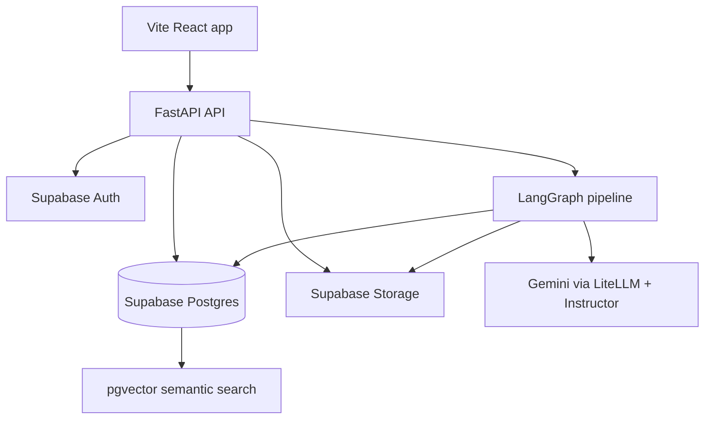
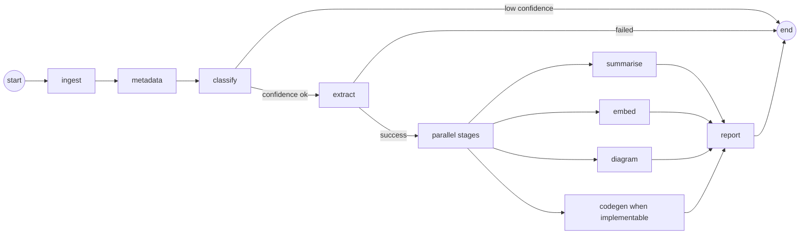

# Architecture

Research Pilot has three main surfaces:

- A Vite React frontend for ingestion, library browsing, pipeline progress, and paper viewing.
- A FastAPI backend for auth-aware paper APIs, pipeline run management, search, and exports.
- A LangGraph pipeline that turns papers into typed outputs.

## System Overview



## Pipeline Topology



`pipeline/src/graph/pipeline.py` owns the graph topology. Nodes are isolated in `pipeline/src/graph/nodes/`, and routing logic lives in `pipeline/src/graph/edges.py`.

## Why LangGraph

Research Pilot is not a single prompt. It is a multi-stage workflow with routing, resumability, stage status, and independent outputs. LangGraph gives the project a clear graph model for:

- Stage boundaries and retry behavior.
- Conditional routing after classification and extraction.
- Parallel downstream work after structured extraction.
- A single compiled graph that services can invoke and track.

## Why Gemini Native PDF Understanding

The pipeline needs diagrams, tables, equations, and figure-level context. A text-only parser loses too much of that information before extraction starts. Gemini native PDF understanding lets the extraction stage reason over the paper as a full document and then Instructor validates the model output into typed schemas.

## Domain Plugins

Domain plugins let the system adapt schemas and prompts without hardcoding one paper type everywhere. A plugin provides:

- A stable `domain_id`.
- Domain-specific schemas.
- Prompt templates for extraction, summaries, diagrams, and code generation.
- Registration through `pipeline/src/domains/registry.py`.

The AI/ML domain is implemented in `pipeline/src/domains/ai_ml/`.

## Storage Model

Supabase is used for:

- Authenticated user identity.
- Postgres records for papers, runs, stages, and outputs.
- pgvector embeddings for semantic search.
- Storage buckets for PDFs and generated artifacts.

The backend uses SQLAlchemy async sessions, service classes for business logic, and FastAPI dependencies to bind services to each request.

## Caching Strategy

The pipeline has stage-level cache behavior controlled by `PIPELINE_CACHE_ENABLED`. Completed stages can be skipped on rerun so retries do not waste LLM calls or overwrite valid artifacts unnecessarily. Cache keys are tied to paper identity, stage name, and persisted output records.

## Output Contract

The UI reads a strict output bundle through `/api/v1/papers/{paper_id}/outputs`. Generated code and notebooks are exposed as separate artifact endpoints only when the output bundle contains real artifact paths.

## Database Migrations

Alembic migrations live in `pipeline/src/db/migrations`. The project expects:

```ini
script_location = %(here)s/src/db/migrations
```

in `pipeline/alembic.ini`.
