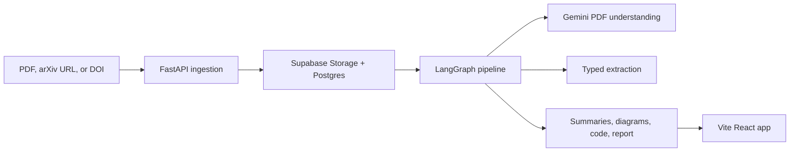

# Research Pilot

<!-- Add the launch demo GIF at assets/demo/research-pilot-demo.gif before making the repo public. -->

Research Pilot is an open source AI pipeline for turning machine learning papers into structured extraction, layered summaries, architecture diagrams, and implementation-oriented code. It is built for researchers, ML engineers, and technical readers who want to understand a paper well enough to compare it, search it, and start implementing it.

## What It Produces

- **Structured extraction**: method, architecture, datasets, metrics, baselines, results, and limitations in a typed output bundle.
- **Multi-level summaries**: short overview, section breakdown, key contributions, and simpler explanations for fast scanning.
- **Architecture diagrams**: Mermaid/SVG-ready diagrams that expose model blocks, data flow, and training or inference paths.
- **Implementation code**: generated Python/PyTorch-oriented source and notebook exports when the paper describes an implementable system.
- **Searchable library**: processed papers are stored with embeddings so they can be searched by concept, method, architecture, or dataset.

## How It Works



The backend is a Python 3.11 FastAPI service. A LangGraph pipeline runs ingestion, metadata extraction, domain classification, structured extraction, summaries, embeddings, diagrams, optional code generation, and report export. Supabase provides auth, Postgres, pgvector search, and object storage. The frontend is a Vite React app.

## Quickstart

```powershell
git clone https://github.com/<your-org>/research-pilot.git
cd research-pilot
Copy-Item .env.example .env
cd pipeline; uv sync --all-extras --dev; uv run alembic upgrade head; uv run uvicorn src.api.main:app --reload
```

In a second terminal:

```powershell
cd app
npm install
npm run dev
```

Open `http://localhost:3000`. The API runs on `http://localhost:8000`, with OpenAPI docs at `http://localhost:8000/docs`.

## Tech Stack

| Layer | Technology |
| --- | --- |
| Frontend | React, Vite, TypeScript, Tailwind CSS, shadcn-style UI components |
| API | FastAPI, Pydantic, SQLAlchemy async |
| Pipeline | LangGraph, Instructor, LiteLLM, Gemini |
| Storage | Supabase Auth, Postgres, Storage, pgvector |
| Tooling | uv, Ruff, mypy, pytest, Vitest, GitHub Actions |

## Self-Hosting

The short version:

1. Create a Supabase project with Postgres, Auth, and Storage enabled.
2. Create `papers` and `outputs` storage buckets.
3. Copy `.env.example` to `.env` and fill in Supabase, Gemini, and optional observability keys.
4. Run `cd pipeline && uv run alembic upgrade head`.
5. Start the API and frontend with the commands above.

See [docs/self-hosting.md](docs/self-hosting.md) for the full guide.

## Configuration

Every environment variable is documented in [docs/configuration.md](docs/configuration.md). Backend settings are loaded from defaults, optional `config.yaml`, environment variables, and `.env` files. Frontend settings live in `app/.env.example`.

## Documentation

- [Architecture](ARCHITECTURE.md)
- [API reference](docs/api.md)
- [Self-hosting](docs/self-hosting.md)
- [Adding a domain plugin](docs/adding-a-domain.md)
- [Prompt engineering](docs/prompt-engineering.md)
- [Configuration](docs/configuration.md)
- [Roadmap](docs/Roadmap.md)

## Roadmap

- Add more domain plugins beyond AI/ML.
- Improve diagram quality for vision, robotics, and multimodal papers.
- Add paper comparison and citation graph views.
- Add Obsidian, Notion, and batch export workflows.
- Build an evaluation harness for extraction quality.

## Contributing

Contributions are welcome. Start with [CONTRIBUTING.md](CONTRIBUTING.md), then look for issues labeled `good first issue`, `help wanted`, or `roadmap`.

## License

MIT. See [LICENSE](LICENSE).
